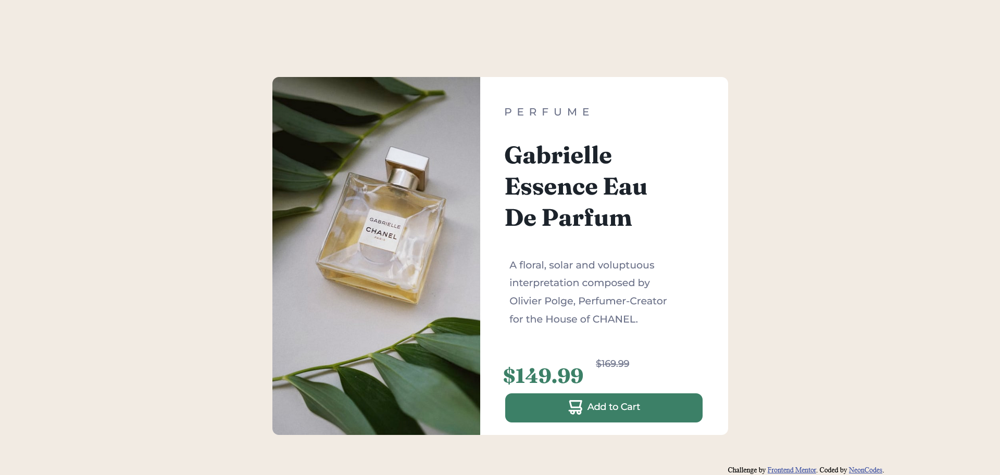

# Frontend Mentor - Product preview card component solution

This is a solution to the [Product preview card component challenge on Frontend Mentor](https://www.frontendmentor.io/challenges/product-preview-card-component-GO7UmttRfa). Frontend Mentor challenges help you improve your coding skills by building realistic projects. 

## Table of contents

- [Overview](#overview)
  - [The challenge](#the-challenge)
  - [Screenshot](#screenshot)
  - [Links](#links)
- [My process](#my-process)
  - [Built with](#built-with)
  - [What I learned](#what-i-learned)
  - [Continued development](#continued-development)
  - [Useful resources](#useful-resources)
- [Author](#author)

## Overview

### The challenge

Users should be able to:

- View the optimal layout depending on their device's screen size
- See hover and focus states for interactive elements

### Screenshot

### Links

- Solution URL: (https://github.com/NeonCodes/Blog-preview-card-challenge)
- Live Site URL:(https://productpagepreviewch.netlify.app/)

## My process

### Built with

- Semantic HTML5 markup
- Flexbox
- Mobile-first workflow
- Sass

### What I learned
- Starting with a mobile-first approach and building the desktop version from there using media queries
-Trying Sass
-Trying to implement more accessibility with aria
-Using the picture element

### Continued development
Continue to improve on the above and try CSS grid on a project

### Useful resources

- [resource 1](https://www.w3schools.com/sass/default.php) - This helped me understand the basics of Sass. 
- [resource 2](https://www.freecodecamp.org/news/how-to-use-sass-with-css/) - more Sass docs.
-[resource 3](https://www.aditus.io/aria/aria-label/) - starting with aria labels
-[resource 4](https://www.youtube.com/watch?v=Rik3gHT24AM&t=32s)- This video helped me understand how the picture element works

## Author

- Frontend Mentor - [@NeonCodes](https://www.frontendmentor.io/profile/NeonCodes)

